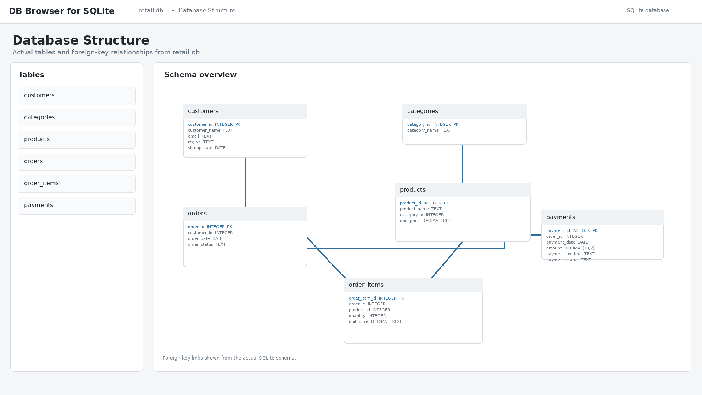
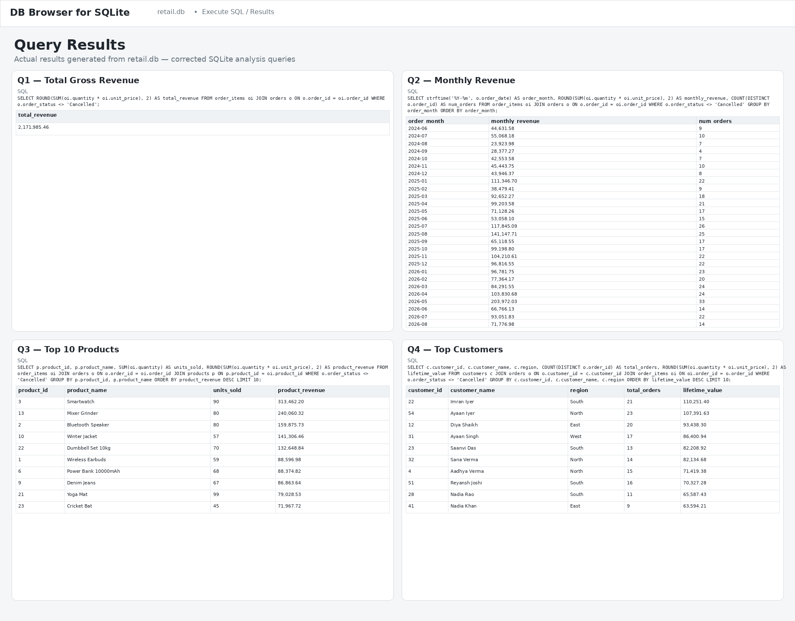
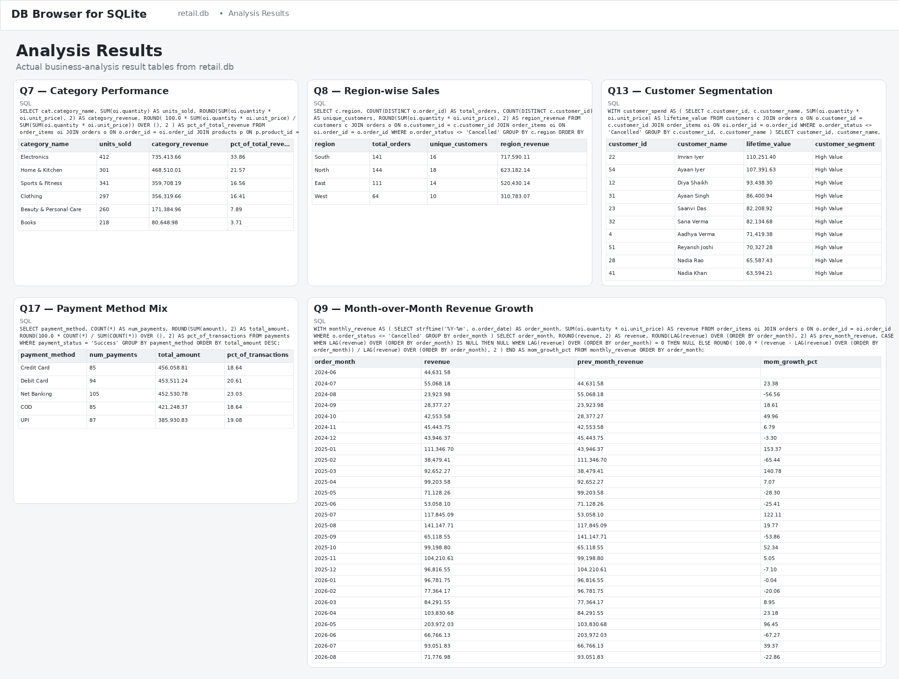

# Retail Sales & Customer Analytics — SQL Project

A self-contained SQL analytics project simulating a retail e-commerce
business, built to demonstrate the SQL skills Data Analyst interviews
test most: joins, aggregation, subqueries, CTEs, and window functions.

## Files

| File | What it is |
|---|---|
| `01_schema.sql` | 6 tables, primary/foreign keys, indexes |
| `02_seed_data.sql` | Sample data: 60 customers, 30 products, 6 categories, 480 orders, 936 order line items, 469 payments, spread across ~27 months |
| `03_analysis_queries.sql` | 20 business-question queries, fully commented |
| `retail.db` | Pre-built SQLite database — open it directly, no setup needed |

Every query in `03_analysis_queries.sql` has already been run against
`retail.db` and verified to execute without error and return sane
results — you're not starting from untested code.

## Schema (ER overview)

```
customers ──< orders ──< order_items >── products >── categories
                │
                └──< payments
```

One addition vs. the original brief: an `order_items` table sits
between `orders` and `products`. Real orders contain multiple
products, so this join table is what makes "top products" and
"category performance" answerable at all — it's standard in every
production retail schema and worth mentioning if asked about it.

## Business questions / analysis queries answered

The SQL file contains **20 executable analysis queries**:

1. Q1 — Total gross revenue
2. Q2 — Monthly gross revenue
3. Q3 — Top 10 products by gross revenue
4. Q4 — Highest-value customers by gross spend
5. Q5 — Repeat customers
6. Q5b — Repeat-customer rate
7. Q6 — Average order value (overall)
8. Q6b — Average order value by month
9. Q7 — Category-wise performance with revenue share
10. Q8 — Region-wise sales
11. Q9 — Month-over-month revenue growth
12. Q10 — Customers who haven't purchased recently
13. Q10b — Customers with zero orders ever
14. Q11 — Best-performing product per category, including ties
15. Q12 — Revenue contribution % per product
16. Q13 — Customer segmentation by spend
17. Q14 — Customers whose AOV is above the overall AOV
18. Q15 — Days between consecutive completed orders
19. Q16 — Net revenue collected
20. Q17 — Payment method mix

## SQL concepts covered

`SELECT` · `WHERE` · `GROUP BY` · `HAVING` · `ORDER BY` · `JOIN`
(inner, left) · `CASE WHEN` · independent subqueries ·
CTEs (`WITH`) · window functions — `ROW_NUMBER()`, `RANK()`, `LAG()`,
`LEAD()`, `SUM() OVER()` · date functions

## How to run it

**Fastest — SQLite (no install):**
```bash
sqlite3 retail.db
.read 03_analysis_queries.sql
```
Or open `retail.db` in [DB Browser for SQLite](https://sqlitebrowser.org/)
(free, GUI, good for a portfolio demo/screenshot).

**PostgreSQL / MySQL:**
The schema and seed data are designed around the SQLite-tested project.
PostgreSQL and MySQL may require dialect-specific changes, particularly
for date functions such as SQLite's strftime() and julianday().

## Notes for talking about this in an interview

- Revenue excludes `Cancelled` orders everywhere; `Returned` orders
  are included in "gross" revenue but excluded in the separate "net
  revenue collected" query (Q16) — a distinction worth raising
  yourself, it shows you think about data quality, not just syntax.
- Q11 keeps both `ROW_NUMBER()` and `RANK()` side by side so you can
  explain the tie-handling difference on the spot if asked.
- Q9 and Q12 use window functions to avoid self-joins — a common
  follow-up question is "how would you do this without window
  functions," which you can answer using a self-join on
  `order_month - 1` or a correlated subquery.


## Project Preview

### Database Schema


### Query Results


### Analysis Results

